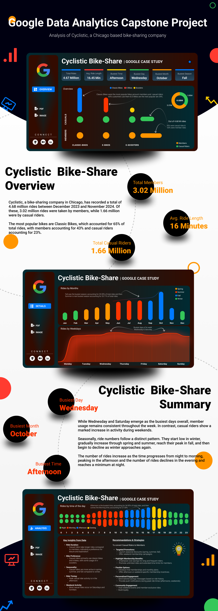

# 🚲 Cyclistic Bike-Share Case Study

Welcome to the **Cyclistic Bike-Share Case Study** repository! This project was part of the **Google Data Analytics Capstone**. It demonstrates how data analytics can help solve business challenges, specifically understanding the usage patterns of Cyclistic's bike-share system and identifying strategies to convert casual riders into annual members.


## 📜 Blog Post

Read the full write-up of the case study on Medium:  
[**Unlocking the Power of Data: A Cyclistic Bike-Share Case Study**](https://medium.com/@srinivasbarla2000/unlocking-the-power-of-data-a-cyclistic-bike-share-case-study-ddb9e3b9b061)


## 🌟 Overview

Cyclistic is a bike-share company in Chicago that operates over 5,800 bicycles and 600 docking stations. The goal of this case study is to analyze user behavior and design strategies to increase the number of annual memberships.

Key business question:  
**How do annual members and casual riders use Cyclistic bikes differently?**

Using Python for data cleaning and feature engineering, and Tableau for data visualization, this project provides actionable insights into customer behavior.


## 🛠️ Tools and Technologies

- **Python**: For data cleaning, preprocessing, and feature engineering.
- **Pandas**: Data manipulation and aggregation.
- **Matplotlib**: For exploratory data analysis.
- **Tableau**: To design an interactive dashboard and visualize insights.
- **Jupyter Notebooks**: For documenting and sharing the analysis process.


## 📊 Key Insights

1. **Usage Trends**:
   - Members prefer weekday rides, often for commuting.
   - Casual riders favor weekends and leisure rides.
   - Afternoon rides are the most popular time of day.
2. **Seasonal Patterns**:
   - Peak usage occurs during summer and fall.
   - Winter sees a significant decline in ridership.
3. **Ride Type Preferences**:
   - Classic bikes are more popular among members.
   - Casual riders often opt for electric or leisurely rides.


## 📂 Repository Structure

```bash
├── data/                           # Data files (raw, interim, and cleaned)
│   ├── raw/                        # Raw datasets (not included)
│   ├── interim/                    # Preprocessed datasets
│   └── final/                      # Final datasets for visualization
├── notebooks/                      # Jupyter Notebooks
│   ├── data_cleaning.ipynb         # Data cleaning and preprocessing
│   └── analysis.ipynb              # Exploratory data analysis
├── visualizations/                 # Tableau dashboard and exported visuals
├── README.md                       # Documentation
└── LICENSE                         # License for the repository
```


## 🌟 Tableau Dashboard

Explore the interactive Tableau dashboard to view:  
- Insights into ridership trends by time, day, and season.  
- Breakdown of ride durations, distances, and speeds.  
- Popular stations for starting and ending rides.

[**Click here to view the Tableau Dashboard**](https://public.tableau.com/app/profile/srinivas.barla/viz/CYCLISTIC_17336421351400/Dashboard4)


[**Click here to view the Tableau Dashboard**](https://public.tableau.com/app/profile/srinivas.barla/viz/CYCLISTIC_17336421351400/Dashboard4)


## ⚖️ License

This repository is licensed under the MIT License. See the [LICENSE](LICENSE) file for details.
